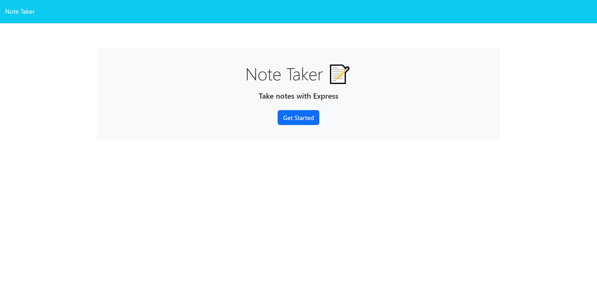

# Note Taker Starter Code

## Description

A note taking application that allows the user to write, view, or delete notes using Express.js for the back end

## Installation

Before downloading the repo, make sure you have node.js installed. After that, install the repo and use the command line to reach the downloaded repo's directory. Install npm, express, uuid, then run `npm run start`.

## Usage

After opening the application, click the 'Get Started' button. You can make a new note by entering in a title and description for the note. Then save the note by pressing the floppy disk icon in the top right. You can see all saved notes on the left side of the screen, and view their details by clicking on them. If you are done viewing your notes and want to submit a new one, click the plus button on the top right of the screen.

